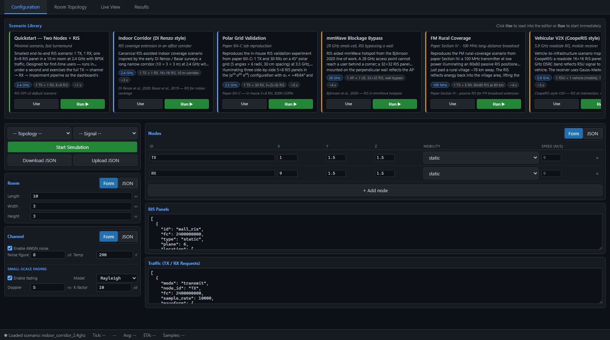
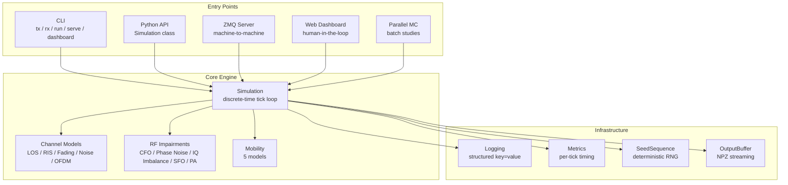
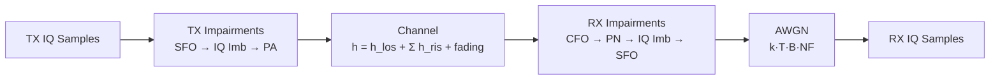
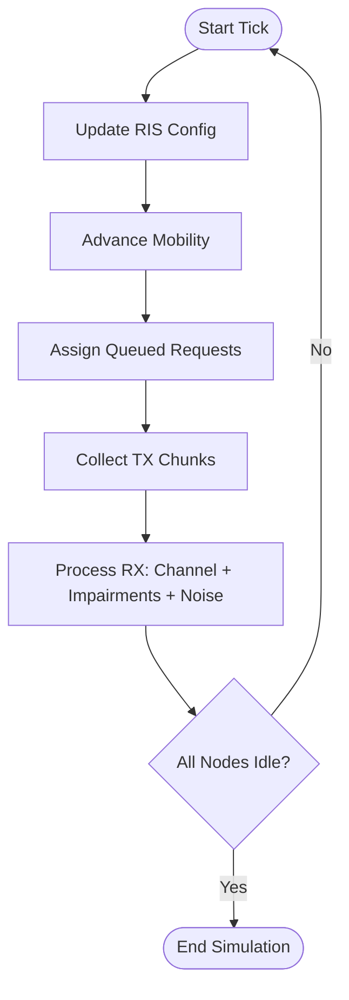
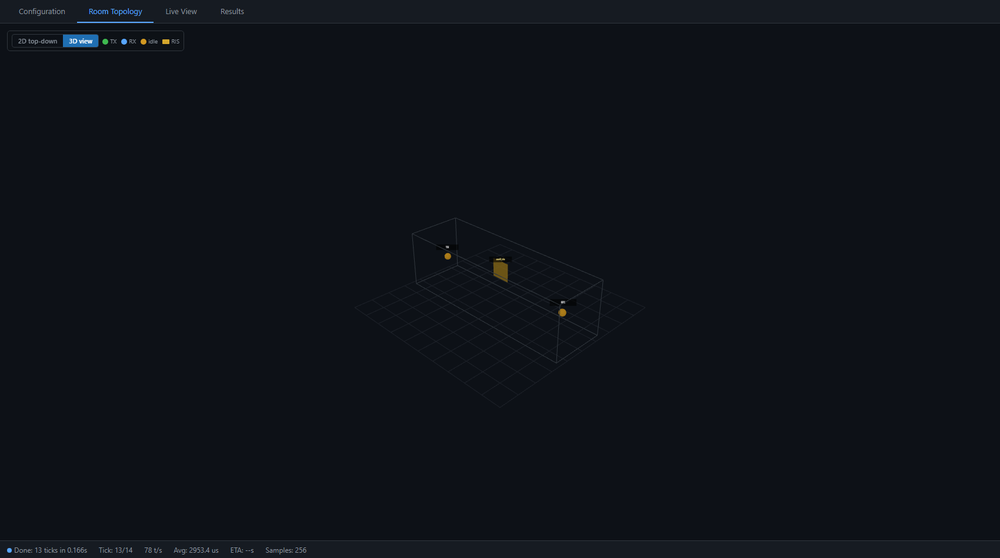
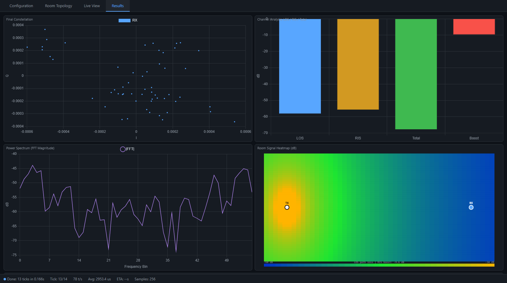
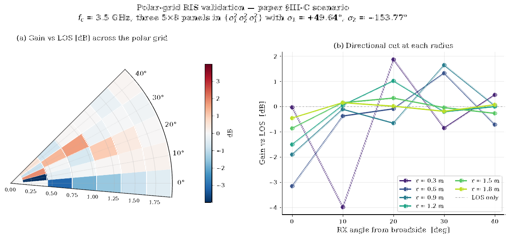
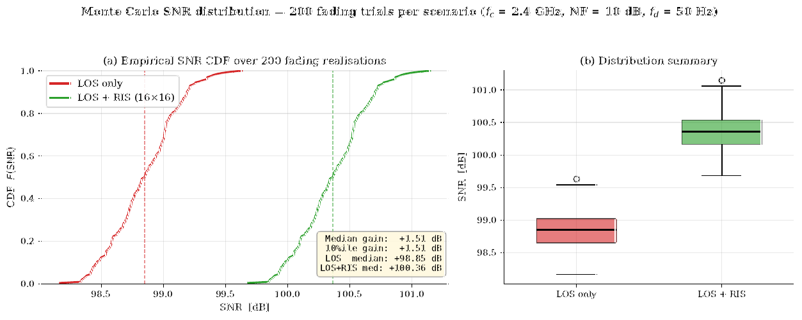
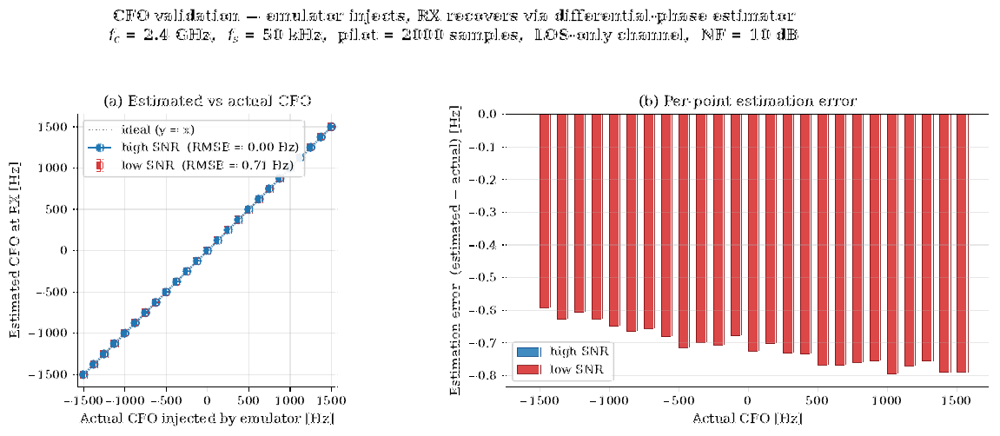
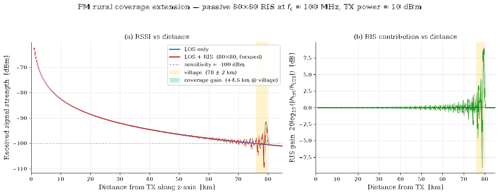

# RIS-SIM v2 — Open Emulator for Smart Radio Environments

[](https://github.com/Galabavamsi/RIM-SIM-V2/actions)
[](https://pypi.org/project/ris-sim/)
[](LICENSE)
[](https://github.com/astral-sh/ruff)
[](https://mypy-lang.org/)

A production-grade software emulator for **Reconfigurable Intelligent Surface (RIS)** assisted wireless communication systems. Replicates SDR behavior and RIS effects at the baseband level — no physical hardware required.

```bash
pip install git+https://github.com/Galabavamsi/RIM-SIM-V2.git
ris-sim dashboard
```



The dashboard ships with:

- **Scenario Library** of paper-grounded examples (Quickstart, Polar-Grid Validation §III-C, Indoor Corridor, mmWave Blockage, FM Rural Coverage, Vehicular V2X) — click **Use** to load into the editor, or **Run ▶** to execute immediately.
- **Form ↔ JSON config editor** — Room and Channel as number inputs / checkboxes, Nodes as an editable table, RIS and Traffic as JSON. Toggle per panel; both views stay in sync.
- **2D / 3D topology view** — Three.js scene with orbit / pan / zoom, wireframe room, TX/RX spheres, RIS panels oriented per their `plane` normal.
- **Live simulation feed** — constellation, IQ time series, received power, and RIS heatmap update at 20 Hz over a WebSocket while the engine runs.

---

## Table of Contents

- [Architecture](#architecture)
- [Quick Start](#quick-start)
- [Featured scenarios](#featured-scenarios)
- [Installation](#installation)
- [Usage](#usage)
  - [Python API](#python-api)
  - [CLI Commands](#cli-commands)
  - [Web Dashboard](#web-dashboard)
  - [ZeroMQ Server/Client](#zeromq-serverclient)
  - [Parallel Monte Carlo](#parallel-monte-carlo)
- [Scenario Format](#scenario-format)
- [Signal Models](#signal-models)
- [Reproducible paper figures](#reproducible-paper-figures)
- [Project Structure](#project-structure)
- [Testing](#testing)
- [Contributing](#contributing)
- [License](#license)
- [Citation](#citation)

---

## Architecture



### Signal Processing Pipeline



### Tick Loop



---

## Quick Start

```bash
# Install
pip install git+https://github.com/Galabavamsi/RIM-SIM-V2.git
ris-sim dashboard          # opens http://127.0.0.1:8080 — pick a scenario card, hit Run
```

Or, headless from a script:

```python
from ris_sim.web.session import load_scenario
from ris_sim.core.engine import Simulation

sc = load_scenario("paper_polar_grid_3.5ghz")
sim = Simulation.from_scenario(sc, seed=42)
# ...queue traffic, sim.run(), inspect output...
```

---

## Featured scenarios

Six paper-grounded scenarios ship with the package and appear as cards in the dashboard's Scenario Library. They double as fixtures for the Python API and reference inputs for the figure suite.

| ID | Source | Frequency | Topology |
|----|--------|-----------|----------|
| `quickstart_two_nodes_2.4ghz`  | RIS-SIM v2 default                   | 2.4 GHz  | 1 TX + 1 RX, 8×8 RIS |
| `paper_polar_grid_3.5ghz`      | Paper §III-C lab reproduction        | 3.5 GHz  | 1 TX + 30 RX, 3×(5×8) RIS |
| `indoor_corridor_2.4ghz`       | Di Renzo / Basar 2020 indoor coverage | 2.4 GHz  | 1 TX + 1 RX, 16×16 RIS, 10 m corridor |
| `mmwave_blockage_28ghz`        | Björnson 2020 mmWave hotspot         | 28 GHz   | 1 AP + 1 UE, 32×32 RIS, wall bypass |
| `paper_fm_rural_coverage`      | Paper §IV passive FM RIS             | 100 MHz  | 1 TX + 5 RX, 80×80 RIS at 80 km |
| `vehicular_v2x_5.9ghz`         | CoopeRIS-style V2X with mobility     | 5.9 GHz  | 1 RSU + 1 vehicle (mobile), 16×16 RIS |

Each scenario file at `ris_sim/web/scenarios/*.json` uses a metadata envelope:

```json
{
  "meta": {
    "name": "...",
    "subtitle": "...",
    "description": "...",
    "citation": "...",
    "category": "quickstart | validation | application",
    "tags": ["..."],
    "frequency_label": "...",
    "topology_label": "...",
    "estimated_runtime_s": 4
  },
  "scenario": { /* room, ris, nodes, channel, traffic */ }
}
```

---

## Installation

```bash
# From GitHub (recommended)
pip install git+https://github.com/Galabavamsi/RIM-SIM-V2.git

# Or clone and install locally
git clone https://github.com/Galabavamsi/RIM-SIM-V2.git
cd RIM-SIM-V2
pip install -e .

# With optional dependencies
pip install -e ".[dev]"    # pytest, ruff, mypy
pip install -e ".[web]"    # fastapi, uvicorn (dashboard)
```

**Requirements**: Python 3.10+, numpy, matplotlib, pyzmq. See `pyproject.toml` for full list.

---

## Usage

### Python API

```python
from ris_sim.core.engine import Simulation
import numpy as np

# Create simulation from a scenario dict
sim = Simulation.from_scenario_file("scenario.json")

# Or build programmatically
sim = Simulation.from_scenario({
    "room": {"length": 10, "width": 10, "height": 10},
    "ris": [],
    "nodes": [
        {"id": "tx", "location": [1, 5, 5]},
        {"id": "rx", "location": [9, 5, 5]},
    ],
    "channel": {"enable_noise": False},
})

# Queue TX (IQ samples) and RX (sample count)
sim.queue_tx("tx", [[1.0, 0.0] for _ in range(100)], fc=2.4e9, sample_rate=5880)
sim.queue_rx("rx", num_samps=100, fc=2.4e9, sample_rate=5880)

# Run with progress bar
output = sim.run(show_progress=True)

# Access results
samples = output.entries[0].flatten_iq()  # complex ndarray
output.save_npz("results.npz")

# Metrics
print(sim.metrics.report())
```

### Channel Sounding

```python
# Measure complex channel coefficients between two nodes
result = sim.channel_sound("tx", "rx", fc=2.4e9, pilot_length=200)
print(f"h_los:  {result['h_los']}")
print(f"h_ris:  {result['h_ris']}")
print(f"h_total: {result['h_total']}")
print(f"Path loss: {result['path_loss_db']} dB")
print(f"Phase: {result['phase_deg']} deg")
```

### RF Impairments

```python
# Configure per-node RF impairments in the scenario
scenario = {
    "nodes": [{
        "id": "rx",
        "rf": {
            "cfo_hz": 150.0,              # Carrier Frequency Offset
            "phase_noise_dbc_hz": -85.0,   # Phase noise
            "amplitude_imbalance_db": 0.5, # IQ gain mismatch
            "phase_imbalance_deg": 2.0,    # IQ phase skew
            "sfo_ppm": 5.0,                # Sample Frequency Offset
            "pa_model": {"type": "rapp", "p_sat_db": 30.0}  # PA nonlinearity
        }
    }],
    "channel": {
        "enable_noise": True,
        "noise_figure_db": 5.0,           # Receiver noise figure
        "small_scale": {
            "enabled": True,
            "model": "rayleigh",          # or "rician"
            "max_doppler_hz": 50.0
        }
    }
}
```

### Live RIS Control

```python
# Reconfigure RIS mid-simulation
sim.ris_set_config("ris_1", np.zeros((8, 8)))  # disable RIS
sim.tick()  # next tick uses new config

sim.ris_set_config("ris_1", np.ones((8, 8)))   # re-enable (all ones)
sim.tick()
```

### CLI Commands

```bash
# Direct simulation (run-and-export)
ris-sim run scenario.json -o results/

# Server mode (accepts ZMQ requests from clients)
ris-sim serve scenario.json --bind tcp://127.0.0.1:5555

# Client: send TX
ris-sim tx --node node_1 --fc 2.4e9 --sample-rate 5880

# Client: receive RX (blocks until data ready)
ris-sim rx --node node_2 --fc 2.4e9 --sample-rate 5880 --samples 120 -o rx.npy

# Query server status
ris-sim status

# Update RIS config on running server
ris-sim ris-config ris_1 --uniform 0.5

# Stop server
ris-sim stop

# Web dashboard
ris-sim dashboard --port 8080
```

### Web Dashboard

```bash
ris-sim dashboard
```

Opens at `http://127.0.0.1:8080` with 4 tabs:

| Tab | Content |
|-----|---------|
| **Configuration** | Top: **Scenario Library** of paper-grounded cards (color-coded by category). Below: editor with a **Form / JSON** toggle per panel — Room and Channel render as number inputs and checkboxes; Nodes is a table with add / delete / inline edit; RIS and Traffic stay as JSON for matrix/waveform editing. Form ↔ JSON sync is two-way. |
| **Room Topology** | **2D top-down / 3D view** toggle. 2D is an interactive canvas (click to add nodes, drag to reposition). 3D is a Three.js scene with orbit / pan / zoom — wireframe room, color-coded TX/RX spheres with labels, RIS panels rendered as oriented rectangles. |
| **Live View** | 2×2 grid: Constellation (I/Q), IQ Time Series, Received Power, RIS Heatmap. Updates during simulation. |
| **Results** | Final constellation, Channel Analysis bar chart (LOS/RIS/Total/Boost), FFT spectrum, Room signal heatmap, Metrics table. |

#### Configuration tab — Scenario Library + form-based editor


The Form view is the default. Click **JSON** in any panel header to edit raw JSON; switching back resyncs the form widgets from the JSON. This means you can mix-and-match: tweak `length` in the form, paste a giant `configuration_matrix` into the RIS JSON, never lose data.

#### Topology tab — 3D view (Three.js)



Toggle to **3D view** in the toolbar. The scene reads from the same source of truth as the 2D canvas (the `cfg-*` textareas), so loading a scenario card immediately repopulates both views. Camera auto-fits to the room — works for a 10 m corridor and an 80 km FM link without manual tuning.

#### Results tab — populated after running a scenario



### ZeroMQ Server/Client

```python
from ris_sim.radio.api import send_to_simulator, receive_from_simulator

# These connect to a running `ris-sim serve` instance
send_to_simulator(iq_data, fc=2.4e9, sample_rate=5880, node_id="node_1")
result = receive_from_simulator(120, fc=2.4e9, sample_rate=5880, node_id="node_2")
# result is a complex ndarray
```

### Parallel Monte Carlo

```python
from ris_sim.parallel import parallel_run, MonteCarloResult

mc = MonteCarloResult()
for output, seed in parallel_run(scenario, trials=100, workers=8, show_progress=True):
    snr = compute_snr_from_output(output["outputs"][0])
    mc.record_snr(snr)

print(mc.summary())
# Monte Carlo: 100 trials (0 errors)
#   SNR mean:    12.45 dB
#   SNR median:  11.93 dB
#   SNR p10-p90: 8.2 - 16.1 dB

mc.plot_snr_cdf("snr_cdf.png")
```

---

## Scenario Format

```json
{
    "room": {"length": 10.0, "width": 10.0, "height": 10.0},
    "ris": [{
        "id": "ris_1",
        "fc": 2400000000.0,
        "type": "static",
        "plane": 5,
        "location": [0.0, 5.0, 5.0],
        "unit_cell_m_length": 0.05,
        "unit_cell_n_length": 0.05,
        "unit_cell_gap": 0.01,
        "array_size": [8, 8],
        "phase_response": {"1": [0.707, 0.707]},
        "configuration_matrix": [[1,1,1,1,1,1,1,1], ...]
    }],
    "nodes": [
        {
            "id": "TX",
            "location": [2.0, 4.0, 5.0],
            "mobility": {"type": "static", "speed": 0.0},
            "rf": {"cfo_hz": 0.0}
        },
        {
            "id": "RX",
            "location": [2.0, 6.0, 5.0],
            "mobility": {"type": "static", "speed": 0.0},
            "rf": {"cfo_hz": 150.0}
        }
    ],
    "channel": {
        "enable_noise": true,
        "noise_figure_db": 5.0,
        "temperature_k": 290.0,
        "small_scale": {
            "enabled": false,
            "model": "rayleigh",
            "max_doppler_hz": 50.0,
            "k_factor_db": 10.0
        }
    },
    "traffic": [
        {
            "mode": "transmit",
            "node_id": "TX",
            "fc": 2400000000.0,
            "sample_rate": 5880.0,
            "waveform": {
                "kind": "bpsk_bits",
                "bits": [0,0,1,1,0,1,1,0],
                "amplitude": 0.1,
                "samples_per_symbol": 10
            }
        },
        {
            "mode": "receive",
            "node_id": "RX",
            "fc": 2400000000.0,
            "sample_rate": 5880.0,
            "num_samps": 80
        }
    ]
}
```

### Waveform Types

| Kind | Description | Fields |
|------|-------------|--------|
| `bpsk_bits` | BPSK modulated from bitstream | `bits`, `amplitude`, `samples_per_symbol` |
| `iq_pairs` | Raw [I, Q] sample pairs | `samples` — list of `[real, imag]` |

### Mobility Models

| Type | Parameters |
|------|-----------|
| `static` | `speed: 0` |
| `random_walk` | `speed` (m/s) |
| `random_waypoint` | `speed` (m/s) |
| `random_direction` | `speed` (m/s) |
| `gauss_markov` | `speed`, `alpha`, `mean_speed`, `mean_angle` |

---

## Signal Models

### Channel

| Component | Description |
|-----------|-------------|
| **LOS** | Free-space path loss: `h = λ/(4πd) × exp(-j2πd/λ)` |
| **RIS** | Per-element cascaded: `Σ b_n × √(cosθ_i·cosθ_r) × h_in × h_out` |
| **Fading** | Rayleigh / Rician with AR(1) time correlation, configurable Doppler |
| **Noise** | Thermal AWGN: `σ² = k·T·B·NF / 2` per I/Q component |

### Impairments

| Impairment | Model | Parameter |
|-----------|-------|-----------|
| **CFO** | Rotating phasor: `exp(j·2π·cfo·t)` | `cfo_hz` |
| **Phase Noise** | Wiener process | `phase_noise_dbc_hz` |
| **IQ Imbalance** | Gain: `I'=I×√g, Q'=Q/√g + I×sin(φ)` | `amplitude_imbalance_db`, `phase_imbalance_deg` |
| **SFO** | Linear resampling | `sfo_ppm` |
| **PA** | Rapp model: `A_out = A_in×G / (1+(A_in×G/A_sat)^(2p))^(1/(2p))` | `pa_model` |

### OFDM

```python
from ris_sim.radio.ofdm import ofdm_modulate, ofdm_demodulate

# Modulate
tx_samples = ofdm_modulate(symbols, n_subcarriers=64, cp_len=16)

# ...channel...

# Demodulate + estimate + equalize
rx_symbols = ofdm_demodulate(rx_samples, n_subcarriers=64, cp_len=16)
h_est = ofdm_ofdm_channel_estimate(rx_symbols, pilots, pilot_indices, 64)
equalized = ofdm_equalize(rx_symbols, h_est)
```

---

## Reproducible paper figures

Every figure under `paper/figures/` is generated end-to-end by driving the actual `Simulation` engine (no canned numpy data). One command regenerates the entire suite:

```bash
python -m paper.figures_src.run_all          # ~100 s, writes 6 PDFs + 6 CSVs + 6 meta.json sidecars
```

Each figure script under `paper/figures_src/fig_*.py` is self-contained: it builds a scenario, drives the engine, writes the PDF to `paper/figures/`, the underlying numbers to `paper/figures_data/<name>.csv`, and a `<name>.meta.json` sidecar with the seed + git commit + parameters so reviewers can verify or re-run.

| Figure | Source | What it shows | File |
|--------|--------|---------------|------|
| **A1** Polar-grid validation | Paper §III-C | 30 RX on a 45° polar arc, three 5×8 RIS panels at 3.5 GHz, peak gain at θ=20° | [polar_grid_validation.pdf](paper/figures/polar_grid_validation.pdf) |
| **A2** CFO validation | Paper Fig 2 | Sweep injected CFO, recover via differential-phase estimator. RMSE = 0 Hz at high SNR | [cfo_validation.pdf](paper/figures/cfo_validation.pdf) |
| **A3** Emulation-time profile | Paper Fig 3 | Wall-clock per tick vs node count for τ ∈ {0.3, 0.5, 1.0} s, two pipeline modes | [emulation_time.pdf](paper/figures/emulation_time.pdf) |
| **A4** SNR CDF | Paper Fig 5 | 200 Monte Carlo trials via `parallel_run`, +1.51 dB median gain matches analytical prediction | [snr_cdf.pdf](paper/figures/snr_cdf.pdf) |
| **A5** FM rural coverage | Paper §IV | RIS extends FM coverage from 75.3 km → 79.9 km, peak +8.98 dB at the village | [fm_coverage.pdf](paper/figures/fm_coverage.pdf) |
| **A6** Dashboard screenshots | Live dashboard | Real Playwright screenshots of the running web UI | [dashboard.pdf](paper/figures/dashboard.pdf) |

Examples:

| Polar-grid validation (paper §III-C) | SNR CDF — Monte Carlo |
|:---:|:---:|
|  |  |
| **CFO validation** | **FM rural coverage** |
|  |  |

```bash
python -m paper.figures_src.fig_polar_grid     # individual figures
python -m paper.figures_src.fig_snr_cdf
python -m paper.figures_src.fig_fm_coverage
# ...
```

---

## Project Structure

```
RIM-SIM-V2/
├── pyproject.toml              # Package config, dependencies, CLI entry point
├── Dockerfile                  # Docker build
├── README.md
├── .gitignore
├── .github/workflows/ci.yml    # CI: 3 OS × 3 Python
│
├── ris_sim/
│   ├── __init__.py
│   ├── core/
│   │   ├── engine.py           # Simulation class (main entry)
│   │   ├── state.py            # NodeState, RisController, OutputBuffer
│   │   ├── server.py           # SimulationServer (ZMQ IPC)
│   │   ├── random.py           # SeedSequence (deterministic RNG)
│   │   ├── logging.py          # Structured logging
│   │   └── metrics.py          # Per-tick timing instrumentation
│   │
│   ├── channel/
│   │   ├── noise.py            # AWGN (thermal + noise figure)
│   │   └── fading.py           # Rayleigh, Rician (AR1)
│   │
│   ├── radio/
│   │   ├── api.py              # SDR-like client API
│   │   ├── impairments.py      # CFO, PN, IQ, SFO, PA
│   │   └── ofdm.py             # OFDM mod/demod, channel estimation
│   │
│   ├── io/
│   │   └── transport.py        # ZeroMQ transport layer
│   │
│   ├── parallel/               # Monte Carlo execution
│   │   ├── __init__.py         # parallel_run()
│   │   ├── worker.py           # Per-trial subprocess
│   │   └── result.py           # MonteCarloResult + CDF plotting
│   │
│   ├── web/                    # Dashboard
│   │   ├── app.py              # FastAPI app
│   │   ├── session.py          # DashboardSession + scenario/template loaders
│   │   ├── static/index.html   # Frontend (single-file SPA)
│   │   ├── scenarios/          # Featured paper-grounded scenarios (cards)
│   │   └── templates/          # Legacy topo_/sig_ snippet templates
│   │
│   ├── modules/                # Legacy modules (kept for compat)
│   │   ├── channel_functions.py
│   │   ├── mobility_functions.py
│   │   ├── simulator_functions.py
│   │   ├── validation.py
│   │   ├── json_store.py
│   │   ├── scenario.py
│   │   ├── results.py
│   │   └── plotting.py
│   │
│   ├── cli/
│   │   └── main.py             # CLI entry point (serve, run, tx, rx, dashboard, ...)
│   │
│   ├── config/                 # Default JSON configs
│   └── tests/
│       ├── test_engine.py      # 10 tests
│       ├── test_channel_model.py
│       ├── test_validation.py
│       ├── test_server.py      # 5 tests
│       ├── test_signal_model.py # 21 analytical validation tests
│       ├── test_parallel.py    # 12 tests
│       ├── test_phase_g.py     # 8 tests (RIS control + channel sounding)
│       ├── test_dashboard.py   # 10 tests
│       ├── test_golden.py      # 10 tests (regression + edge cases)
│       ├── test_json_store.py
│       ├── test_plotting.py
│       ├── test_results.py
│       ├── test_scenario.py
│       └── golden/             # Reference output for regression
│
├── examples/
│   └── two_node_ris/           # Self-contained example
│       ├── run_example.py
│       └── scenario.json
│
├── scenarios/                  # Standalone fixture library (edge cases, RF impairments)
│   ├── edge_cases/
│   └── rf_impairments/
│
├── paper/                      # Conference-ready figures (engine-driven, reproducible)
│   ├── figures_src/
│   │   ├── _common.py          # Shared paper plot style + meta.json sidecar writer
│   │   ├── fig_polar_grid.py   # A1 — paper §III-C reproduction
│   │   ├── fig_cfo_validation.py    # A2
│   │   ├── fig_emulation_time.py    # A3
│   │   ├── fig_snr_cdf.py            # A4 — uses parallel_run for Monte Carlo
│   │   ├── fig_fm_coverage.py        # A5 — paper §IV
│   │   ├── fig_dashboard.py          # A6 — Playwright screenshots of live UI
│   │   └── run_all.py                # Orchestrator: regenerates everything in ~100 s
│   ├── figures/                # Output PDFs (one per figure)
│   └── figures_data/           # Raw CSVs + meta.json sidecars (seed + commit)
│
└── docs/
    └── images/                 # README screenshots
```

---

## Testing

```bash
# Run all 103 tests
python -m pytest ris_sim/tests -v

# Run with coverage
pip install -e ".[dev]"
python -m pytest ris_sim/tests --cov=ris_sim

# Golden regression (bit-identical output with fixed seed)
python -m pytest ris_sim/tests/test_golden.py -v

# Lint + typecheck
python -m ruff check ris_sim
python -m mypy ris_sim
```

---

## Contributing

1. Fork the repository
2. Create a feature branch: `git checkout -b feature/my-feature`
3. Install dev dependencies: `pip install -e ".[dev]"`
4. Make changes, add tests
5. Run `python -m pytest ris_sim/tests -v` — all 103 must pass
6. Run `python -m ruff check ris_sim` — must be 0 errors
7. Submit a pull request

### Adding a new channel model
Add a file to `ris_sim/channel/`, import it in `engine.py`, and add a flag in the scenario `channel` config. No engine changes needed for the tick loop.

### Adding a new mobility model
Add to `ris_sim/modules/mobility_functions.py`, register the type string in `validation.py:VALID_MOBILITY_TYPES`.

---

## Citation

If you use this emulator in your research, please cite:

```bibtex
@inproceedings{ris-sim-v2,
  title     = {An Open Emulator for Smart Radio Environments},
  booktitle = {IEEE ANTS 2025},
  year      = {2025},
  note      = {Software available at https://github.com/Galabavamsi/RIM-SIM-V2}
}
```

---

## License

MIT License. See [LICENSE](LICENSE) for details.
